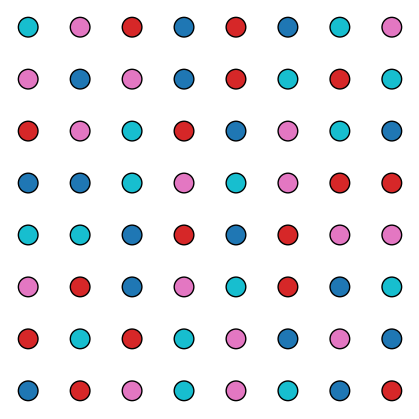

## Authors

**Leonardo Martínez-Sandoval** ([Google Scholar](https://scholar.google.es/citations?hl=es&pli=1&user=hUjL-FwAAAAJ))  
**Gabriela Araujo-Pardo** ([Google Scholar](https://scholar.google.es/citations?user=btyNjrYAAAAJ&hl=es))


# Coloring the Euclidean Grid and Affine Planes

This repository accompanies a research paper on exact colorings of finite geometries that avoid monochromatic collinear triples. The paper focuses on the Euclidean grid $[n]^2$ and the affine plane $AG(2,q)$. The included Jupyter notebooks implement efficient algorithms to find such colorings, and explore the structure of maximal arcs.

## Notebooks


### clean_projective.ipynb
Implements a backtracking coloring solver for the affine plane $AG(2,q)$ using the Minimum Remaining Values (MRV) heuristic and forward checking.

It implements:

- Construction of the projective and affine planes, and collinearity relations.
- Exact coloring algorithms for $AG(2,q)$.
- Search for minimal colorings and maximal arcs in the affine setting.
- Visualization and result export.
- Saves results to text files in the `results_projective/` directory.

### clean_euclidean.ipynb
This notebook is similar to the previous one, but it is focused on colorings of the Euclidean grid $[n]^2$. The notebook:

- Defines the grid and collinearity test (integer determinant).
- Searches for the minimal number of colors needed to avoid monochromatic collinear triples for $n=1$ to $n=9$.
- Explores the construction of maximal general position sets (arcs) with recursive algorithms.
- Finds collections of pairwise disjoint maximal arcs.
- Visualizes colorings and arcs using matplotlib.
- Storage of results to text files in the `results_euclidean/` directory.

## Dependencies

The code is designed to be minimal and portable. The only non-standard dependency is:

- `matplotlib` (for visualization)

All other code uses only the Python standard library and common scientific packages (e.g., `itertools`, `functools`, `typing`).

## Example Output

Below is a sample visualization of a coloring (see `output.png`):



## How to Cite

If you use this code or results in your work, please cite the accompanying paper. A BibTeX entry will be provided here:


```bibtex
@article{martinez2026arcchromatic,
	title={The arc chromatic number for Galois projective planes, affine planes and Euclidean grids},
	author={Araujo-Pardo, Gabriela and Martínez-Sandoval, Leonardo},
	journal={arXiv preprint},
	year={2026},
	eprint={TBD},
	url={TBD}
}
```

---
For questions or suggestions, please open an issue or contact the authors.
